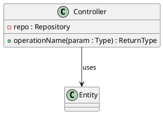

# @TITLE@

## Metadata
| Key | Value |
| --- | --- |
| ID | @ID@ |
| CrossReference | @CROSSREF@ |

## Version History
| Date | Status | Author | Reviewer | Change | Commit |
| --- | --- | --- | --- | --- | --- |
| @DATE@ | Proposed | @AUTHOR@ | <reviewer S-ID> | Initial version | pending |

---

## Purpose and Scope

## Diagram

## Class Table

| Class | Refines (Domain Model concept) | Responsibility | Attributes | Operations |
| --- | --- | --- | --- | --- |

## Method Traceability

| Method signature | Operation Contract / SD message |
| --- | --- |

## Pattern Annotations

| Pattern | Classes | Rationale |
| --- | --- | --- |

## Dependency Check

---

@LINKS@
