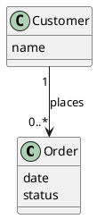

# @TITLE@

## Metadata
| Key | Value |
| --- | --- |
| ID | @ID@ |
| CrossReference | @CROSSREF@ |
| Language | @LANGUAGE@ |
| Domain | @DOMAIN@ |

## Version History
| Date | Status | Author | Reviewer | Change | Commit |
| --- | --- | --- | --- | --- | --- |
| @DATE@ | Proposed | @AUTHOR@ | <reviewer S-ID> | Initial version | pending |

---

## Purpose and Scope

Covers: <use cases>

## Diagram

Concepts, attributes and associations only — no operations.

## Concept Table

| Concept | Definition | Attributes | Source (use case / glossary) |
| --- | --- | --- | --- |

## Association Table

| From | Association (reading direction) | To | Multiplicity |
| --- | --- | --- | --- |

## Generalizations

| General | Specializations | Is-a justification |
| --- | --- | --- |

---

@LINKS@
