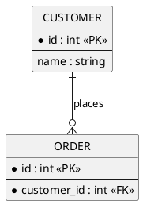

# @TITLE@

## Metadata
| Key | Value |
| --- | --- |
| ID | @ID@ |
| CrossReference | @CROSSREF@ |

## Version History
| Date | Status | Author | Reviewer | Change | Commit |
| --- | --- | --- | --- | --- | --- |
| @DATE@ | Proposed | @AUTHOR@ | <reviewer S-ID> | Initial version | pending |

---

## Purpose and Scope

## Diagram

## Entity Table

### <ENTITY>

| Attribute | Type | PK/FK | Nullable | Source (DCD class.attribute) |
| --- | --- | --- | --- | --- |

## Relationship Table

| Entity | Cardinality | Entity | FK | Rule |
| --- | --- | --- | --- | --- |

## Normalization Notes

---

@LINKS@
