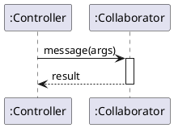

# @TITLE@

## Metadata
| Key | Value |
| --- | --- |
| ID | @ID@ |
| CrossReference | @CROSSREF@ |

## Version History
| Date | Status | Author | Reviewer | Change | Commit |
| --- | --- | --- | --- | --- | --- |
| @DATE@ | Proposed | @AUTHOR@ | <reviewer S-ID> | Initial version | pending |

---

## Sequence: <operationName>

**Realizes:** `operationName` in [OC-<n>]

### Diagram

### Pattern Annotations

| Pattern (GRASP / GoF) | Applied to | Rationale |
| --- | --- | --- |

### Postcondition Coverage

| Postcondition (from contract) | Satisfied by message |
| --- | --- |

### Responsibility Check

---

@LINKS@
