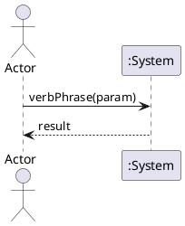

# @TITLE@

## Metadata
| Key | Value |
| --- | --- |
| ID | @ID@ |
| CrossReference | @CROSSREF@ |
| Language | @LANGUAGE@ |
| Domain | @DOMAIN@ |

## Version History
| Date | Status | Author | Reviewer | Change | Commit |
| --- | --- | --- | --- | --- | --- |
| @DATE@ | Proposed | @AUTHOR@ | <reviewer S-ID> | Initial version | pending |

---

## Source Use Case

<Use case name> ([UC-<n>]) — scenario: <main success scenario | named alternate>

## Diagram

## System Operations

| Step | Message | Parameters | Return | Use case step |
| --- | --- | --- | --- | --- |

## Lifecycle Notes

---

@LINKS@
