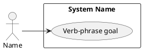

# @TITLE@

## Metadata
| Key | Value |
| --- | --- |
| ID | @ID@ |
| CrossReference | @CROSSREF@ |
| Language | @LANGUAGE@ |
| Domain | @DOMAIN@ |

## Version History
| Date | Status | Author | Reviewer | Change | Commit |
| --- | --- | --- | --- | --- | --- |
| @DATE@ | Proposed | @AUTHOR@ | <reviewer S-ID> | Initial version | pending |

---

## Purpose and Scope

<system boundary in words>

## Diagram

## Actor Table

| Actor | Stereotype | Stakeholder ID (SA) | Goals (use cases) |
| --- | --- | --- | --- |

## Use Case Table

| Use Case | Actor(s) | Goal |
| --- | --- | --- |

## Relationships

| From | Relationship (`<<include>>` / `<<extend>>`) | To | Justification |
| --- | --- | --- | --- |

---

@LINKS@
