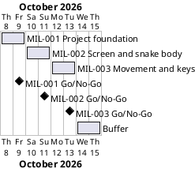

# Project Plan: Snake Game

## Metadata
| Key | Value |
| --- | --- |
| ID | PP-001 |
| CrossReference | [BC-001], [SA-001], [MIL-001], [MIL-002], [MIL-003] |
| Language | en |
| Domain | it |

## Version History
| Date | Status | Author | Reviewer | Change | Commit |
| --- | --- | --- | --- | --- | --- |
| 2026-10-08 | Deprecated | Jens Tirsvad Nielsen | S01 | Initial version | pending |
| 2026-10-08 | Accepted | Jens Tirsvad Nielsen | S01 | Closed the GitHub viewers open issue on S01's decision: a git host workflow sets the GitHub copy's description and topics | pending |

---

## Purpose

This plan schedules the three milestones that deliver the Snake Game repository
of [BC-001] within one week. Each milestone is one gateway document, one branch
and one pull request, so that every step is kept track of and reviewed before
the next one starts.

## Planning Assumptions

- Week 1 starts 2026-10-08; the plan ends by 2026-10-15, which leaves two days
  of buffer after the last gateway. All dates are proposed and need the Product
  Owner's confirmation (see Open Issues).
- Phase length: one to two days, sized for the spare time of S01, who owns
  every phase ([SA-001]).
- Gateway order follows the code, not the lecture order: first the repository
  foundation, then the window and the snake body (lecture 1 and the class part
  of lecture 3), then movement and keys (lectures 2 and 4). The lectures first
  write the snake as loose code and then move it into the `Snake` class; this
  project builds the class directly, so the end state of lecture 3 is the
  starting point for every later gateway.
- One branch per milestone, named after it (`mil-001-project-foundation`,
  `mil-002-screen-and-snake-body`, `mil-003-movement-and-keys`), and one pull
  request that closes the issues of that milestone with one `Closes #N` line
  each.
- Nothing is committed, pushed or merged until S01 asks; S01 reviews the working
  tree first.

## Gateway Schedule

| Gateway | Document | Window | Decision date | Owner | Stories | Main deliverable | Milestone |
| --- | --- | --- | --- | --- | --- | --- | --- |
| Project foundation | [MIL-001] | 2026-10-08 to 2026-10-09 | 2026-10-09 | S01 | None (see Open Issues) | `pyproject.toml`, `.gitignore`, `constants.py`, README, `Doxyfile`, continuous integration (CI) workflow | [milestone-82] |
| Screen and snake body | [MIL-002] | 2026-10-10 to 2026-10-11 | 2026-10-11 | S01 | None (see Open Issues) | Window set-up, `Snake` class with `create_snake`, `python -m snake_game`, with tests | [milestone-83] |
| Movement and keys | [MIL-003] | 2026-10-12 to 2026-10-13 | 2026-10-13 | S01 | None (see Open Issues) | `move`, animation loop, `head`, `up`/`down`/`left`/`right`, key bindings, finished README | [milestone-84] |



## Scope Coverage

| Business Case scope item | Gateway |
| --- | --- |
| Lecture "Screen Setup and Creating a Snake Body": window and three segments | [MIL-002] |
| Lecture "Create a Snake Class & Move to OOP": the `Snake` class | [MIL-002], extended in [MIL-003] |
| Lecture "Animating the Snake Segments on Screen": `tracer`, `update`, `sleep`, `move` | [MIL-003] |
| Lecture "Controlling the Snake with Keypresses": `head`, directions, key bindings, no reversal | [MIL-003] |
| Constants in `constants.py`; `src/`, `tests/`, `docs/` layout | [MIL-001] |
| `pyproject.toml`, Python `.gitignore`, `Doxyfile`, README, continuous integration workflow | [MIL-001], README finished in [MIL-003] |
| Repository description and topics | Done on 2026-10-08 on the git host; criterion 9 of [MIL-001] checks it |

## Dependencies

```
MIL-001 → MIL-002 → MIL-003
```

A No-Go on a gateway returns it to S01 for rework and moves every later date by
the same number of days; the two buffer days absorb up to two days of slip
before the end date of 2026-10-15 moves.

## Plan Risks

| Risk | Impact | Mitigation |
| --- | --- | --- |
| The planning documents take longer to review than the game takes to write | The first gateway slips | Review [BC-001], [SA-001] and this plan together in one sitting; keep the milestones small |
| Author and reviewer are the same person (S01) | A review can miss a defect | Use the QC checklists and the pull request as the second look; recorded in [BC-001] |
| The git host has no Actions runner | The CI workflow is never executed | Run the same commands locally before each pull request; decide later whether a runner is needed |
| Lecture details are only available as the summaries in the request | The game differs from the video | S01 compares the finished game with the video at the [MIL-003] Go/No-Go |

## Open Issues

- **Dates:** the start date, phase lengths and the end date 2026-10-15 are
  proposed and not given by the Product Owner; confirm or replace them.
- **Product Owner (PO) language:** the request is written in English, so `en` is
  recorded in `docs/artifact-registry.md`; the sections of every PO-language
  document follow it. Confirm, because a later change needs a new review of each
  document.
- **Stakeholder levels:** the Power and Interest levels of S02 and S03 in
  [SA-001] are proposals.
- **Day 21 is out of scope:** the request lists only the four day-20 lectures
  and says that food, collision, score and game over come next. Confirm that
  this repository stops at the end of [MIL-003]; if day 21 belongs here, add
  milestones for it.
- **No user story or use case:** the tasks are written as build steps, so they
  are plain technical tasks. The player's goal (steer the snake) is covered by
  [BC-001] objective 1. If the goal should be modelled, add a Use Case Diagram,
  a user story and a use case and reference them from the task rows.
- **Governance and traceability matrix:** `GOV` and `TM` do not exist yet. The
  review process asks for both (sign-off route and the "Last Reviewed" column).
  Decide whether to create them before the first review record is written.
- **"Python greater than 3.13":** read as Python 3.13 or newer
  (`requires-python = ">=3.13"`); the machine of S01 has Python 3.13.14, which a
  strict "greater than 3.13" would exclude. Confirm.
- **README template:** the Product Owner's README template is used. It differs
  from `framework/templates/README-template.md`, whose headings
  `framework/scripts/check-readme.sh` expects; that check is opt-in and stays
  off.
- **GitHub viewers:** [SA-001] names S03 as GitHub viewers. A GitHub copy of the
  repository exists next to the Tirsvad git host. Closed by S01 on 2026-10-08: a
  workflow on the git host sets the description and topics of the GitHub copy, so
  this project does not touch it.
- **Diagram check:** the Gantt chart above was not rendered because no PlantUML
  server is configured (`PLANTUML_URL`); render it before the review.
- **Sync:** done on 2026-10-08 with `sync-project.sh --accepted-only --apply`:
  Milestones 82 to 84 and Issues #1 to #17 exist on the git host (MIL-001: #1 to
  #6, MIL-002: #7 to #10, MIL-003: #11 to #17). Run the sync again whenever a
  `## Tasks` table changes.

---

[BC-001]: ./business-case.md
[SA-001]: ./stakeholder-analysis.md
[MIL-001]: ./milestones/mil-001-project-foundation.md
[MIL-002]: ./milestones/mil-002-screen-and-snake-body.md
[MIL-003]: ./milestones/mil-003-movement-and-keys.md
[milestone-82]: https://git.tirsystem.com/Tirsvad-Udemy-100-days-of-code/020-snake-game/milestone/82
[milestone-83]: https://git.tirsystem.com/Tirsvad-Udemy-100-days-of-code/020-snake-game/milestone/83
[milestone-84]: https://git.tirsystem.com/Tirsvad-Udemy-100-days-of-code/020-snake-game/milestone/84
