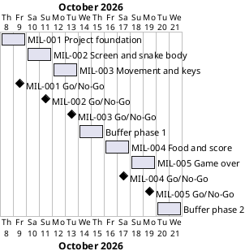

# Project Plan: Snake Game

## Metadata
| Key | Value |
| --- | --- |
| ID | PP-001 |
| CrossReference | [BC-001], [SA-001], [MIL-001], [MIL-002], [MIL-003] |
| Language | en |
| Domain | it |

## Version History
| Date | Status | Author | Reviewer | Change | Commit |
| --- | --- | --- | --- | --- | --- |
| 2026-10-08 | Deprecated | Jens Tirsvad Nielsen | S01 | Closed the GitHub viewers open issue on S01's decision: a git host workflow sets the GitHub copy's description and topics | [a2c997e] |
| 2026-10-08 | Accepted | Jens Tirsvad Nielsen | S01 | Added phase 2 (day 21): MIL-004 and MIL-005, schedule to 2026-10-21, scope coverage, dependencies, a risk and five open issues | [710784f] |

---

## Purpose

This plan schedules the five milestones that deliver the Snake Game repository of [BC-001] in two phases: phase 1 (day 20, three milestones, one week) and phase 2 (day 21, two milestones, added on 2026-10-08). Each milestone is one gateway document, one branch
and one pull request, so that every step is kept track of and reviewed before
the next one starts.

## Planning Assumptions

- Phase 1 starts 2026-10-08 and ends by 2026-10-15, which leaves two days of buffer after [MIL-003]. Phase 2 starts 2026-10-16 and ends by 2026-10-21, with two days of buffer after [MIL-005]. All dates are proposed and need the Product Owner's confirmation (see Open Issues).
- Phase length: one to two days, sized for the spare time of S01, who owns
  every phase ([SA-001]).
- Gateway order follows the code, not the lecture order: first the repository
  foundation, then the window and the snake body (lecture 1 and the class part
  of lecture 3), then movement and keys (lectures 2 and 4). The lectures first
  write the snake as loose code and then move it into the `Snake` class; this
  project builds the class directly, so the end state of lecture 3 is the
  starting point for every later gateway.
- Phase 2 follows the order of the day-21 outline: food, eating and the score first ([MIL-004]), then the game-over rules ([MIL-005]). The outline gives no lecture details, so the numbers of day 21 are assumptions that S01 confirms before the code of each milestone (see Open Issues).
- One branch per milestone, named after it (`mil-001-project-foundation`,
  `mil-002-screen-and-snake-body`, `mil-003-movement-and-keys`, `mil-004-food-and-score`, `mil-005-game-over`), and one pull request that closes the issues of that milestone with one `Closes #N` line
  each.
- Nothing is committed, pushed or merged until S01 asks; S01 reviews the working
  tree first.

## Gateway Schedule

| Gateway | Document | Window | Decision date | Owner | Stories | Main deliverable | Milestone |
| --- | --- | --- | --- | --- | --- | --- | --- |
| Project foundation | [MIL-001] | 2026-10-08 to 2026-10-09 | 2026-10-09 | S01 | None (see Open Issues) | `pyproject.toml`, `.gitignore`, `constants.py`, README, `Doxyfile`, continuous integration (CI) workflow | [milestone-82] |
| Screen and snake body | [MIL-002] | 2026-10-10 to 2026-10-11 | 2026-10-11 | S01 | None (see Open Issues) | Window set-up, `Snake` class with `create_snake`, `python -m snake_game`, with tests | [milestone-83] |
| Movement and keys | [MIL-003] | 2026-10-12 to 2026-10-13 | 2026-10-13 | S01 | None (see Open Issues) | `move`, animation loop, `head`, `up`/`down`/`left`/`right`, key bindings, finished README | [milestone-84] |
| Food and score | [MIL-004] | 2026-10-16 to 2026-10-17 | 2026-10-17 | S01 | None (see Open Issues) | `Food`, `Scoreboard`, `Snake.extend`, eating in the main flow, with tests | [milestone-85] |
| Game over | [MIL-005] | 2026-10-18 to 2026-10-19 | 2026-10-19 | S01 | None (see Open Issues) | Game over at the wall and at the tail, the GAME OVER text, click to close, finished README | [milestone-86] |



## Scope Coverage

| Business Case scope item | Gateway |
| --- | --- |
| Lecture "Screen Setup and Creating a Snake Body": window and three segments | [MIL-002] |
| Lecture "Create a Snake Class & Move to OOP": the `Snake` class | [MIL-002], extended in [MIL-003] |
| Lecture "Animating the Snake Segments on Screen": `tracer`, `update`, `sleep`, `move` | [MIL-003] |
| Lecture "Controlling the Snake with Keypresses": `head`, directions, key bindings, no reversal | [MIL-003] |
| Day-21 step "adding food": the `Food` class | [MIL-004] |
| Day-21 step "detecting collisions between the snake and the food": eating and growing | [MIL-004] |
| Day-21 step "updating the score": the `Scoreboard` class | [MIL-004] |
| Day-21 step "implementing game over": the wall and the tail | [MIL-005] |
| Constants in `constants.py`; `src/`, `tests/`, `docs/` layout | [MIL-001], extended in [MIL-004] and [MIL-005] |
| `pyproject.toml`, Python `.gitignore`, `Doxyfile`, README, continuous integration workflow | [MIL-001], README finished in [MIL-003] and again in [MIL-005] |
| Repository description and topics | Done on 2026-10-08 on the git host; criterion 9 of [MIL-001] checks it |

## Dependencies

```
MIL-001 → MIL-002 → MIL-003 → MIL-004 → MIL-005
```

A No-Go on a gateway returns it to S01 for rework and moves every later date by
the same number of days; the two buffer days of each phase absorb up to two days of slip before the end date of that phase (2026-10-15 for phase 1, 2026-10-21 for phase 2) moves.

## Plan Risks

| Risk | Impact | Mitigation |
| --- | --- | --- |
| The planning documents take longer to review than the game takes to write | The first gateway slips | Review [BC-001], [SA-001] and this plan together in one sitting; keep the milestones small |
| Author and reviewer are the same person (S01) | A review can miss a defect | Use the QC checklists and the pull request as the second look; recorded in [BC-001] |
| The git host has no Actions runner | The CI workflow is never executed | Run the same commands locally before each pull request; decide later whether a runner is needed |
| Lecture details are only available as the summaries in the request | The game differs from the video | S01 compares the finished game with the video at the [MIL-003] and [MIL-005] Go/No-Go |
| The numbers of day 21 are guesses | [MIL-004] or [MIL-005] builds the wrong values | Each milestone lists them as assumptions, and S01 confirms or replaces them before the code is written |

## Open Issues

- **Dates:** the start date, milestone lengths and the end dates 2026-10-15 (phase 1) and 2026-10-21 (phase 2) are proposed and not given by the Product Owner; confirm or replace them.
- **Product Owner (PO) language:** the request is written in English, so `en` is
  recorded in `docs/artifact-registry.md`; the sections of every PO-language
  document follow it. Confirm, because a later change needs a new review of each
  document.
- **Stakeholder levels:** the Power and Interest levels of S02 and S03 in
  [SA-001] are proposals.
- **Day 21 is in scope (closed by S01 on 2026-10-08):** S01 chose to build day 21 in this repository, so [BC-001] now has objectives 8 and 9 and this plan has [MIL-004] and [MIL-005].
- **Day-21 numbers are assumptions:** the request gives day 21 only as an outline (food, collision with food, score, game over). The milestones use the usual values of the course (a blue circle of half size, a collision distance of 15 for the food and 10 for the tail, a wall at 280, the score at the top, a 24-point font); S01 confirms or replaces each against the video before the code of that milestone is written.
- **Inheritance and display-free tests:** the day-21 lectures teach `class Food(Turtle)`, but a class that inherits from `Turtle` needs `turtle` (and so `tkinter`) at import time, unlike `Snake`. The plan keeps the inheritance and has the tests install a fake `turtle` module before they import the classes, and `main` imports `food` and `scoreboard` only when it runs. The alternative is composition (a `Food` that holds a turtle), which keeps imports light but leaves out the lesson. Confirm.
- **Food under the snake:** the lecture's `refresh` picks a random place without looking at the snake. The plan does the same. Confirm, or ask for a place that is free.
- **High score:** the request says that players can share high scores, but none of the four steps stores one. The score is the number shown during the game; storing a high score is out of scope. Confirm.
- **No user story or use case:** the tasks are written as build steps, so they
  are plain technical tasks. The player's goal (steer the snake) is covered by
  [BC-001] objective 1. If the goal should be modelled, add a Use Case Diagram,
  a user story and a use case and reference them from the task rows.
- **Governance and traceability matrix:** `GOV` and `TM` do not exist yet. The
  review process asks for both (sign-off route and the "Last Reviewed" column).
  Decide whether to create them before the first review record is written.
- **"Python greater than 3.13":** read as Python 3.13 or newer
  (`requires-python = ">=3.13"`); the machine of S01 has Python 3.13.14, which a
  strict "greater than 3.13" would exclude. Confirm.
- **README template:** the Product Owner's README template is used. It differs
  from `framework/templates/README-template.md`, whose headings
  `framework/scripts/check-readme.sh` expects; that check is opt-in and stays
  off.
- **GitHub viewers:** [SA-001] names S03 as GitHub viewers. A GitHub copy of the
  repository exists next to the Tirsvad git host. Closed by S01 on 2026-10-08: a
  workflow on the git host sets the description and topics of the GitHub copy, so
  this project does not touch it.
- **Diagram check:** the Gantt chart above was not rendered because no PlantUML
  server is configured (`PLANTUML_URL`); render it before the review.
- **Sync:** done on 2026-10-08 with `sync-project.sh --accepted-only --apply`: Milestones 82 to 84 and Issues #1 to #17 exist on the git host (MIL-001: #1 to #6, MIL-002: #7 to #10, MIL-003: #11 to #17). Milestones 85 and 86 and Issues #18 to #24 (MIL-004) and #25 to #31 (MIL-005) were created on 2026-10-08. The sync matches issues by title, so every task title must be unique across all milestones: the first sync of MIL-005 overwrote Issue #17 of MIL-003 because task 7 of both had the same title; the title of task 7 of MIL-005 was changed and Issue #17 was restored by syncing MIL-003 again. Run the sync again whenever a `## Tasks` table changes.

---

[BC-001]: ./business-case.md
[SA-001]: ./stakeholder-analysis.md
[MIL-001]: ./milestones/mil-001-project-foundation.md
[MIL-002]: ./milestones/mil-002-screen-and-snake-body.md
[MIL-003]: ./milestones/mil-003-movement-and-keys.md
[MIL-004]: ./milestones/mil-004-food-and-score.md
[MIL-005]: ./milestones/mil-005-game-over.md
[milestone-82]: https://git.tirsystem.com/Tirsvad-Udemy-100-days-of-code/020-snake-game/milestone/82
[milestone-83]: https://git.tirsystem.com/Tirsvad-Udemy-100-days-of-code/020-snake-game/milestone/83
[milestone-84]: https://git.tirsystem.com/Tirsvad-Udemy-100-days-of-code/020-snake-game/milestone/84
[milestone-85]: https://git.tirsystem.com/Tirsvad-Udemy-100-days-of-code/020-snake-game/milestone/85
[milestone-86]: https://git.tirsystem.com/Tirsvad-Udemy-100-days-of-code/020-snake-game/milestone/86
[a2c997e]: https://git.tirsystem.com/Tirsvad-Udemy-100-days-of-code/020-snake-game/commit/a2c997e1413e425050df8c50a976ec839ebb4752
[710784f]: https://git.tirsystem.com/Tirsvad-Udemy-100-days-of-code/020-snake-game/commit/710784f2243e7ecf8cec23cbdd9cc58c96cdff96
